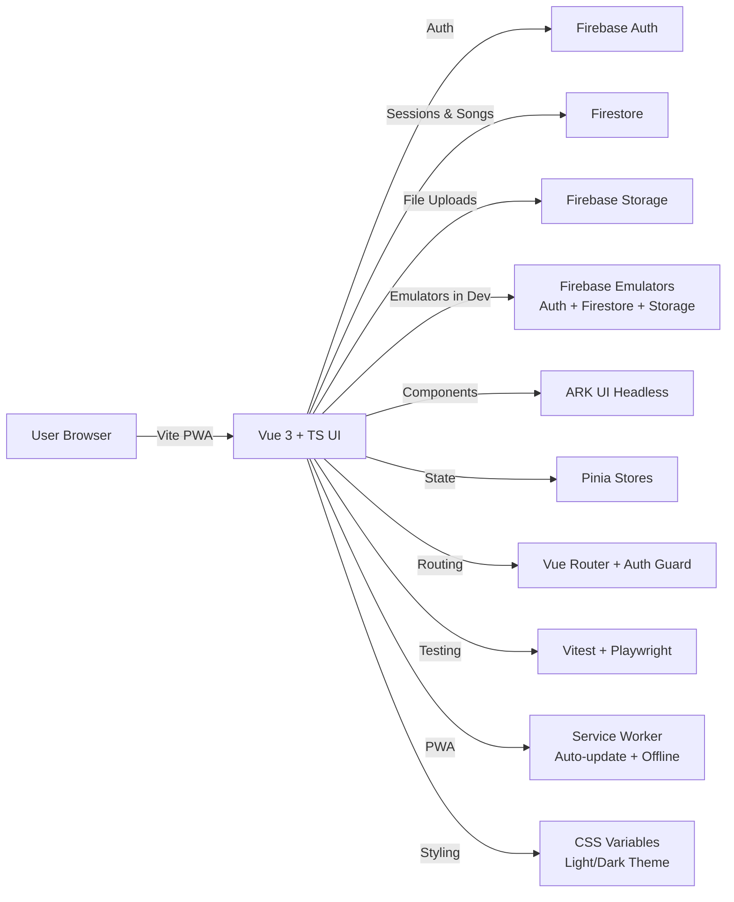

# Architecture Diagram (Mermaid)

## Tech Stack Overview

### Frontend

- **Framework**: Vue 3 Composition API + TypeScript
- **UI Library**: ARK UI (headless components)
- **Icons**: lucide-vue-next
- **State Management**: Pinia
- **Routing**: Vue Router with authentication guards
- **Build Tool**: Vite
- **PWA**: vite-plugin-pwa with auto-update

### Backend (Firebase Free Tier)

- **Authentication**: Firebase Auth (email/password for hosts, anonymous for guests)
- **Database**: Firestore (sessions, songs collections)
- **Storage**: Firebase Storage (future song files)
- **Hosting**: Firebase Hosting with SPA rewrites

### Testing

- **Unit/Component**: Vitest + @testing-library/vue
- **E2E**: Playwright
- **Coverage**: @vitest/coverage-v8

### Development

- **Emulators**: Firebase Auth (9099), Firestore (8080), Storage (9199)
- **Linting**: ESLint + Prettier
- **TypeScript**: Strict mode with enhanced safety flags
