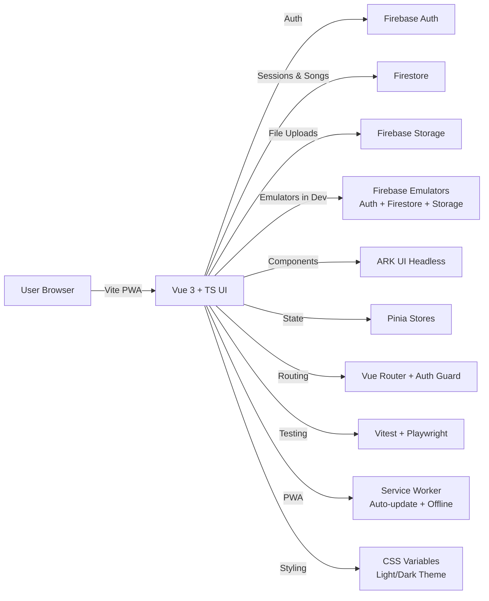

# Architecture Diagram (Mermaid)



## Tech Stack Overview

### Frontend

- **Framework**: Vue 3 Composition API + TypeScript
- **UI Library**: ARK UI (headless components)
- **Icons**: lucide-vue-next
- **State Management**: Pinia
- **Routing**: Vue Router with authentication guards
- **Build Tool**: Vite
- **PWA**: vite-plugin-pwa with auto-update

### Backend (Firebase Free Tier)

- **Authentication**: Firebase Auth (email/password for hosts, anonymous for guests)
- **Database**: Firestore with collections:
  - `sessions`: Hosted and joined sessions with PIN enrollment
  - `songs`: Song library with chords and lyrics
- **Storage**: Firebase Storage (future song files/imports)
- **Hosting**: Firebase Hosting with SPA rewrites

### Testing

- **Unit/Component**: Vitest + @testing-library/vue
- **E2E**: Playwright with Firebase emulators
- **Coverage**: @vitest/coverage-v8

### Development

- **Emulators**: Firebase Auth (9099), Firestore (8080), Storage (9199)
- **Linting**: ESLint + Prettier
- **TypeScript**: Strict mode with `noUncheckedIndexedAccess`, `useUnknownInCatchVariables`, `exactOptionalPropertyTypes`

## Firestore Schema

### Sessions Collection

```typescript
Session {
  id: string;
  name: string;
  hostId: string;
  hostDisplayName: string;
  isActive: boolean;
  pin: string; // 4-digit session PIN
  joinedBy: string[]; // Array of user IDs
  createdAt: Timestamp;
}
```

### Songs Collection

```typescript
Song {
  id: string;
  title: string;
  artist: string;
  text?: string; // Song lyrics with chord notation
  chords?: string[]; // Array of unique chords
  createdAt?: Timestamp;
}
```

## Security Rules Strategy

- **Sessions**: Guest PIN queries allowed for `isActive: true`; protected writes for hosts only
- **Songs**: Public read access; restricted write/delete for admin
- **Free tier only**: No server-side logic; validation and aggregation happen on client
