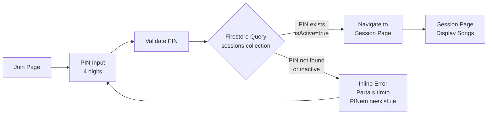
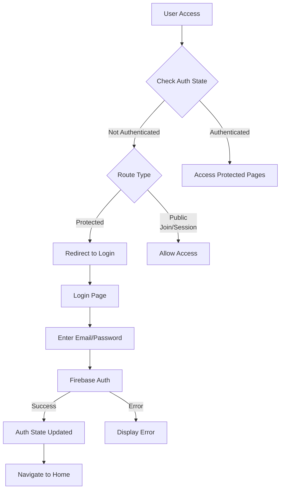
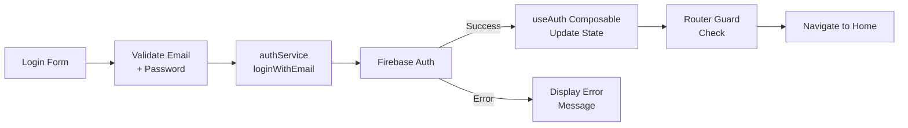
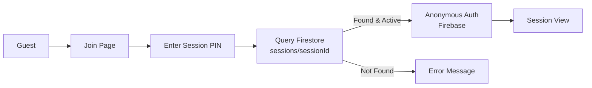

# Data Flow Diagrams (Mermaid)

## Session Join Flow

```mermaid
flowchart LR
  JP[Join Page] --> PI[PIN Input<br/>4 digits]
  PI --> V[Validate PIN]
  V --> FSQ{Firestore Query<br/>sessions collection}
  FSQ -- PIN exists<br/>isActive=true --> NAV[Navigate to<br/>Session Page]
  FSQ -- PIN not found<br/>or inactive --> ERR[Inline Error<br/>Parta s tímto<br/>PINem neexistuje]
  ERR --> PI
  NAV --> SP[Session Page<br/>Display Songs]
```

## Authentication Flow

```mermaid
flowchart TB
  START[User Access] --> CK{Check Auth State}
  CK -- Not Authenticated --> RT{Route Type}
  RT -- Protected --> LOGIN[Redirect to Login]
  RT -- Public<br/>Join/Session --> ALLOW[Allow Access]
  LOGIN --> LP[Login Page]
  LP --> EM[Enter Email/Password]
  EM --> FA[Firebase Auth]
  FA -- Success --> AS[Auth State Updated]
  FA -- Error --> ERRMSG[Display Error]
  AS --> NAV2[Navigate to Home]
  CK -- Authenticated --> HOME[Access Protected Pages]
```

## Host Authentication (Email/Password)

```mermaid
flowchart LR
  L[Login Form] --> V[Validate Email<br/>+ Password]
  V --> AS[authService<br/>loginWithEmail]
  AS --> FA[Firebase Auth]
  FA -- Success --> UA[useAuth Composable<br/>Update State]
  UA --> RG[Router Guard<br/>Check]
  RG --> HOME[Navigate to Home]
  FA -- Error --> E[Display Error<br/>Message]
```

## Guest Access (Future: PIN-based)

```mermaid
flowchart LR
  G[Guest] --> J[Join Page]
  J --> PIN[Enter Session PIN]
  PIN --> Q[Query Firestore<br/>sessions/sessionId]
  Q -- Found & Active --> ANON[Anonymous Auth<br/>Firebase]
  ANON --> S[Session View]
  Q -- Not Found --> ERR[Error Message]
```
