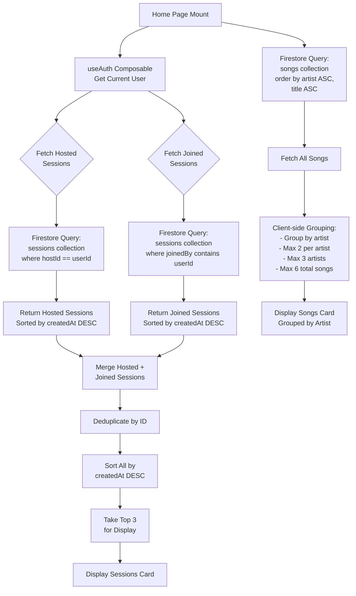
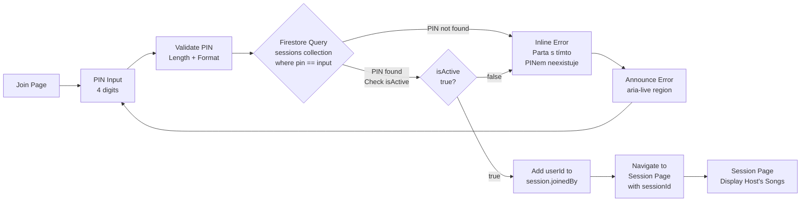
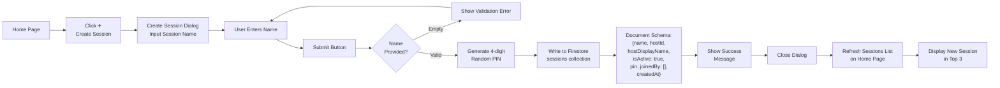
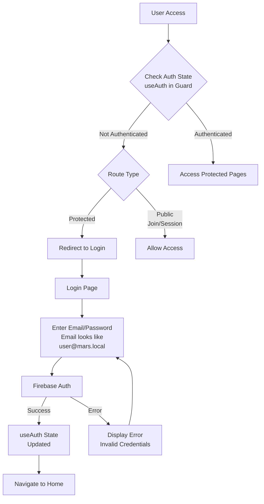
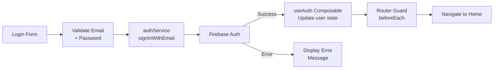
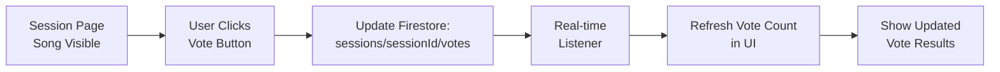

# Data Flow Diagrams (Mermaid)

## Home Page Data Fetching Flow

## Session Join Flow

## Session Creation Flow (Home Page Create Dialog)

## Authentication Flow

## Host Authentication (Email/Password)

## Real-time Voting Flow

