# Folder Map Diagram (Mermaid)

```mermaid
flowchart TB
  ROOT[my-Pisnicka2.0/]

  ROOT --> SRC[src/]
  ROOT --> TESTS[tests/]
  ROOT --> PUBLIC[public/]
  ROOT --> DOCS[docs/]
  ROOT --> CONFIG[config files]
  ROOT --> VITEST[vitest.setup.ts<br/>vitest.config.ts]
  ROOT --> PLAYWRIGHT[playwright.config.ts]

  SRC --> APP[App.vue<br/>main.ts]
  SRC --> PAGES[pages/]
  SRC --> COMPONENTS[components/]
  SRC --> COMPOSABLES[composables/]
  SRC --> LIB[lib/]
  SRC --> ROUTER[router/]
  SRC --> STORES[stores/]
  SRC --> ASSETS[assets/]

  PAGES --> HOME[Home.vue]
  PAGES --> LOGIN[Login.vue]
  PAGES --> JOIN[Join.vue]
  PAGES --> SESSION[Session.vue]
  PAGES --> PTESTS[__tests__/]

  COMPONENTS --> CORE[core/<br/>Button, Field, etc.]
  COMPONENTS --> EMAIL[EmailPasswordLogin.vue]
  COMPONENTS --> HEADER[PageHeader.vue]
  COMPONENTS --> TOPNAV[top-navigation/]

  COMPOSABLES --> USEAUTH[useAuth.ts<br/>+ __tests__/]

  LIB --> FIREBASE[firebase.ts]
  LIB --> AUTHSVC[authService.ts]
  LIB --> ENV[env.ts]

  ROUTER --> INDEX[index.ts<br/>Routes.ts]

  STORES --> FUTURE[Pinia stores<br/>future use]

  TESTS --> E2E[e2e/<br/>Playwright tests]

  PUBLIC --> ICONS[icons/<br/>PWA assets]
  PUBLIC --> MANIFEST[icons.json]

  CONFIG --> VITE[vite.config.ts]
  CONFIG --> TS[tsconfig.*.json]
  CONFIG --> ESLINT[eslint.config.js]
  CONFIG --> FIREBASE[firebase.json<br/>firestore.rules<br/>firestore.indexes.json]
  CONFIG --> ENV[.env.local]

  DOCS --> ARCH[architecture.md]
  DOCS --> FLOW[data-flow.md]
  DOCS --> USER[user-flows.md]
  DOCS --> MAP[folder-map.md]
  DOCS --> INDEX[diagrams.md]
```

## Key Folders Explained

### `src/`

Main application source code organized by concern:

- **pages/**: Vue page components (Home, Login, Join, Session)
- **components/**: Reusable UI components (core/, EmailPasswordLogin, PageHeader, top-navigation/)
- **composables/**: Vue composition functions (useAuth for reactive auth state)
- **lib/**: Core services and utilities (firebase.ts, authService.ts, env.ts)
- **router/**: Vue Router configuration with auth guards
- **stores/**: Pinia state management (currently empty, future use)
- **assets/**: Static assets (images, styles)

### `tests/`

- **e2e/**: Playwright end-to-end tests (auth flow, session join, UI interactions)

### `public/`

Static files served directly:

- **icons/**: PWA icon assets for Android, iOS, Windows
- **icons.json**: Icon manifest for progressive web app

### `docs/`

Visual documentation (Mermaid diagrams):

- Architecture, data flow, user flows, folder map

### Config Files

- **vite.config.ts**: Vite build config + PWA plugin
- **vitest.config.ts**: Unit test runner config
- **vitest.setup.ts**: Test setup with Firebase mocking
- **playwright.config.ts**: E2E test config with emulator env
- **tsconfig.\*.json**: TypeScript strict mode configuration
- **eslint.config.js**: ESLint rules + Prettier integration
- **firebase.json**: Firebase Hosting config with SPA rewrites
- **firestore.rules**: Firestore Security Rules
- **firestore.indexes.json**: Firestore index definitions
