# Folder Map Diagram (Mermaid)

```mermaid
flowchart TB
  ROOT[my-Pisnicka2.0/]

  ROOT --> SRC[src/]
  ROOT --> TESTS[tests/]
  ROOT --> PUBLIC[public/]
  ROOT --> DOCS[docs/]
  ROOT --> CONFIG[config files]
  ROOT --> VITEST[vitest.setup.ts<br/>vitest.config.ts]
  ROOT --> PLAYWRIGHT[playwright.config.ts]

  SRC --> APP[App.vue<br/>main.ts]
  SRC --> PAGES[pages/]
  SRC --> COMPONENTS[components/]
  SRC --> COMPOSABLES[composables/]
  SRC --> LIB[lib/]
  SRC --> ROUTER[router/]
  SRC --> STORES[stores/]
  SRC --> ASSETS[assets/]

  PAGES --> HOME[Home.vue<br/>Home Page with<br/>Sessions & Songs<br/>Overview]
  PAGES --> LOGIN[Login.vue<br/>Email/Password<br/>Auth]
  PAGES --> JOIN[Join.vue<br/>PIN Validation<br/>Flow]
  PAGES --> SESSION[Session.vue<br/>Display Songs &<br/>Voting]
  PAGES --> SESSLIST[SessionsList.vue<br/>All Sessions View]
  PAGES --> SONGLIST[Songs.vue<br/>All Songs View]
  PAGES --> PTESTS[__tests__/]

  COMPONENTS --> CORE[core/<br/>Button, Field,<br/>etc.]
  COMPONENTS --> EMAIL[EmailPasswordLogin.vue]
  COMPONENTS --> HEADER[PageHeader.vue]
  COMPONENTS --> TOPNAV[top-navigation/]
  COMPONENTS --> DIALOGS[Dialogs]

  COMPOSABLES --> USEAUTH[useAuth.ts<br/>+ __tests__/]

  LIB --> FIREBASE[firebase.ts<br/>Firebase SDK Init<br/>+ Emulator Config]
  LIB --> AUTHSVC[authService.ts<br/>Auth Methods]
  LIB --> ENV[env.ts<br/>Env Validation]
  LIB --> SESSION[session.ts<br/>Session Queries<br/>& Helpers]
  LIB --> SONG[song.ts<br/>Song Queries &<br/>Helpers]

  ROUTER --> INDEX[index.ts<br/>Vue Router Setup<br/>+ Auth Guard]
  ROUTER --> ROUTES[Routes.ts]

  STORES --> FUTURE[Pinia stores<br/>future use]

  TESTS --> E2E[e2e/<br/>Playwright E2E<br/>Tests]

  PUBLIC --> ICONS[icons/<br/>PWA assets<br/>Android/iOS/Win]
  PUBLIC --> MANIFEST[icons.json]

  CONFIG --> VITE[vite.config.ts<br/>Vite + PWA]
  CONFIG --> TS[tsconfig.*.json<br/>Strict TS Config]
  CONFIG --> ESLINT[eslint.config.js]
  CONFIG --> FIREBASE[firebase.json<br/>firestore.rules<br/>firestore.indexes.json]
  CONFIG --> ENV[.env.local<br/>Firebase Credentials]

  DOCS --> ARCH[architecture.md<br/>Tech Stack &<br/>Schemas]
  DOCS --> FLOW[data-flow.md<br/>Firestore Queries<br/>& Auth Flows]
  DOCS --> USER[user-flows.md<br/>Host & Guest<br/>Journeys]
  DOCS --> MAP[folder-map.md<br/>This File]
  DOCS --> INDEX[diagrams.md<br/>Diagram Index]
```

## Key Folders Explained

### `src/pages/`

Vue page components for main routes:

- **Home.vue**: Dashboard with sessions overview (latest 3) and songs overview (deterministic 6 grouped by up to 3 artists); buttons to create/join sessions
- **Login.vue**: Email/password authentication for hosts
- **Join.vue**: 4-digit PIN validation for guest access; Firestore query validates `isActive` status
- **Session.vue**: Display host's songs with auto-scroll, chord display, and voting controls
- **SessionsList.vue**: Paginated view of all hosted and joined sessions
- **Songs.vue**: Full song library with filtering and grouping by artist

### `src/lib/`

Core services and utilities:

- **firebase.ts**: Firebase SDK initialization with emulator auto-detection in dev/test modes; env-driven config
- **authService.ts**: Firebase Auth wrapper (sign in, logout)
- **env.ts**: Environment variable validation helper (`requiredEnv()`)
- **session.ts**: Firestore queries for sessions (fetch hosted, joined, by PIN); helpers for sorting and merging
- **song.ts**: Firestore queries for songs (fetch all, filter by artist); client-side grouping logic

### `src/composables/`

Vue composition functions:

- **useAuth.ts**: Reactive auth state (`user`, `isAuthenticated`, `isHost`, `isGuest`); `logout()` method; used in router guard and components

### `src/components/`

Reusable UI components:

- **core/**: Base components (Button, Field, etc.) from ARK UI
- **EmailPasswordLogin.vue**: Email/password form for host login
- **PageHeader.vue**: Top navigation with profile/logout (shared across pages)
- **top-navigation/**: Navigation menu components

### `src/router/`

Vue Router configuration:

- **index.ts**: Router setup with `beforeEach` auth guard calling `useAuth()` inside the guard for fresh auth state; route definitions
- **Routes.ts**: Central route definitions (Home, Login, Join, Session, SessionsList, Songs)

### `tests/e2e/`

Playwright end-to-end tests:

- Auth flow (login, logout)
- Session join with PIN validation
- Home page data loading
- UI interactions (create session, vote, auto-scroll)
- All tests use Firebase emulators and Czech selectors
