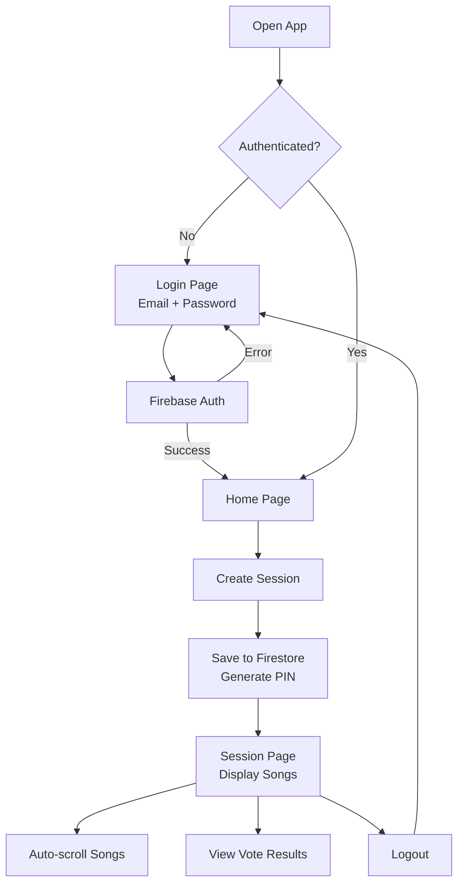
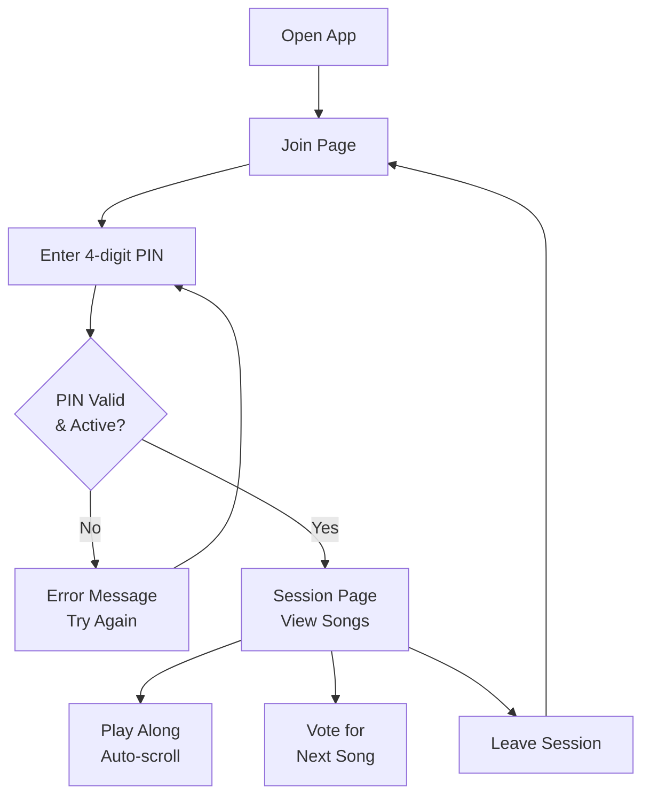
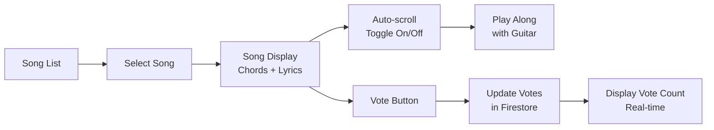
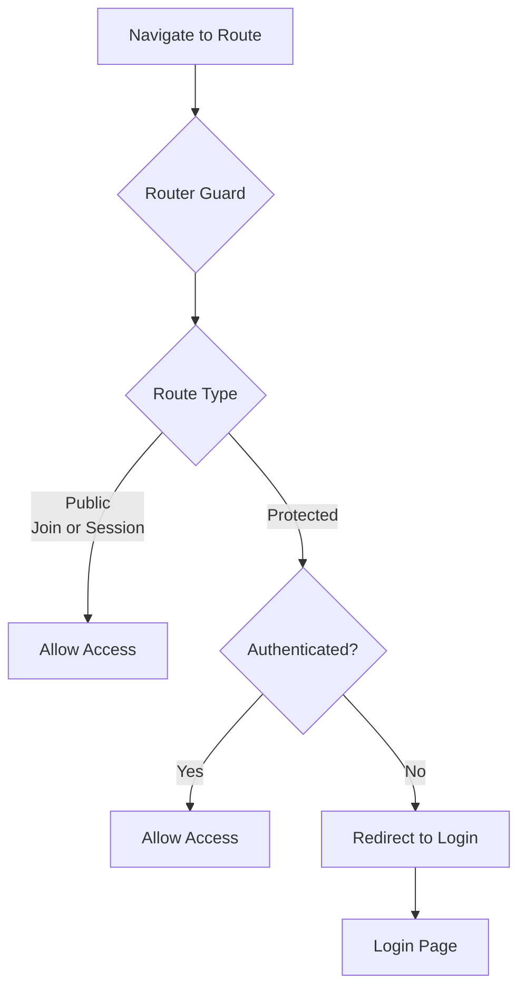

# User Flows Diagram (Mermaid)

## Host User Flow

```mermaid
flowchart TD
  START[Open App] --> AUTH{Authenticated?}
  AUTH -- No --> LOGIN[Login Page<br/>Email + Password]
  LOGIN --> FA[Firebase Auth]
  FA -- Success --> HOME[Home Page]
  FA -- Error --> LOGIN
  AUTH -- Yes --> HOME
  HOME --> CREATE[Create Session]
  CREATE --> FS[Save to Firestore<br/>Generate PIN]
  FS --> SESSION[Session Page<br/>Display Songs]
  SESSION --> SCROLL[Auto-scroll Songs]
  SESSION --> VOTE[View Vote Results]
  SESSION --> LOGOUT[Logout]
  LOGOUT --> LOGIN
```

## Guest User Flow

```mermaid
flowchart TD
  START[Open App] --> JOIN[Join Page]
  JOIN --> PIN[Enter 4-digit PIN]
  PIN --> VALIDATE{PIN Valid<br/>& Active?}
  VALIDATE -- No --> ERR[Error Message<br/>Try Again]
  ERR --> PIN
  VALIDATE -- Yes --> SESSION[Session Page<br/>View Songs]
  SESSION --> PLAY[Play Along<br/>Auto-scroll]
  SESSION --> VOTE[Vote for<br/>Next Song]
  SESSION --> LEAVE[Leave Session]
  LEAVE --> JOIN
```

## Song Display & Interaction Flow

```mermaid
flowchart LR
  SL[Song List] --> SS[Select Song]
  SS --> SD[Song Display<br/>Chords + Lyrics]
  SD --> AS[Auto-scroll<br/>Toggle On/Off]
  AS --> PLAY[Play Along<br/>with Guitar]
  SD --> VOTE[Vote Button]
  VOTE --> VU[Update Votes<br/>in Firestore]
  VU --> VD[Display Vote Count<br/>Real-time]
```

## Route Access Flow

```mermaid
flowchart TD
  NAV[Navigate to Route] --> RG{Router Guard}
  RG --> CHK{Route Type}
  CHK -- Public<br/>Join or Session --> ALLOW[Allow Access]
  CHK -- Protected --> AUTH{Authenticated?}
  AUTH -- Yes --> ALLOW2[Allow Access]
  AUTH -- No --> REDIR[Redirect to Login]
  REDIR --> LOGIN[Login Page]
```
