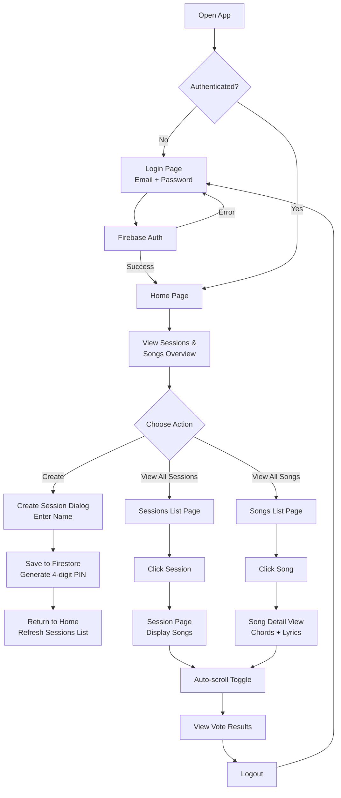
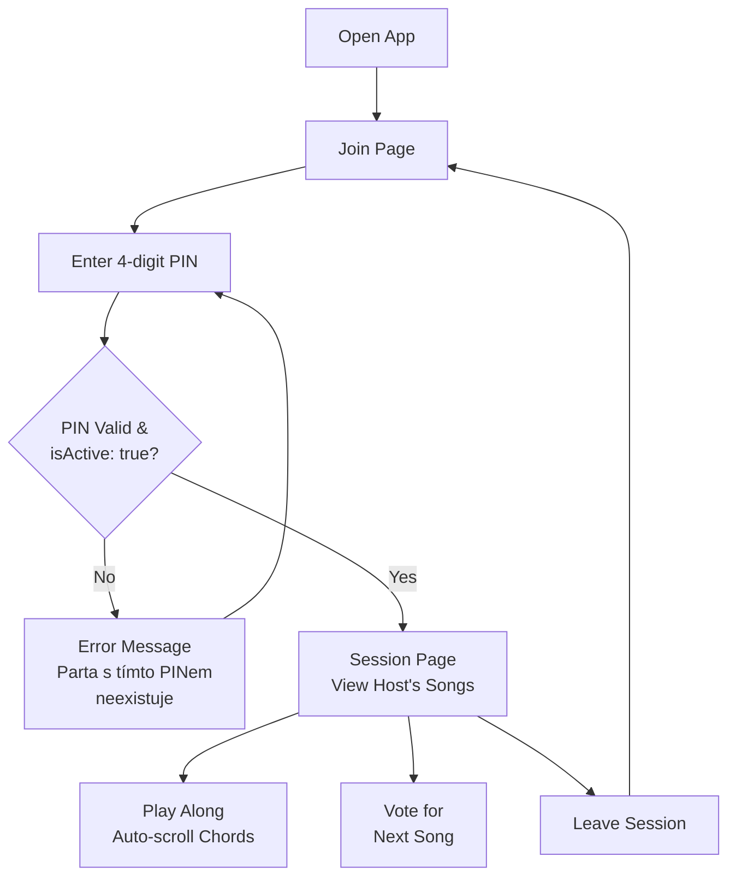
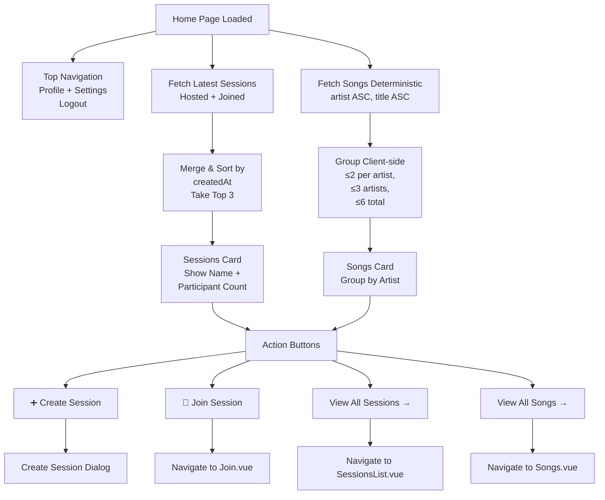
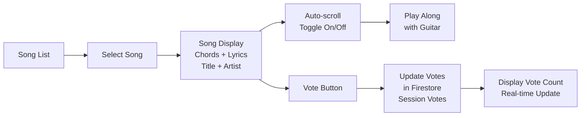
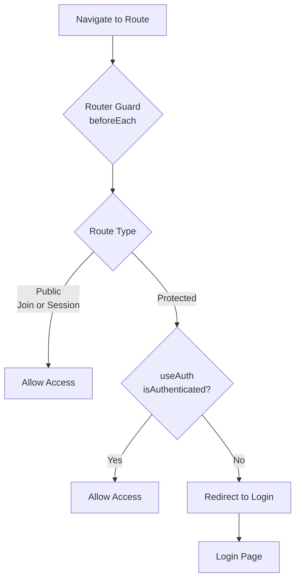

# User Flows Diagram (Mermaid)

## Host User Flow (Complete)

```mermaid
flowchart TD
  START[Open App] --> AUTH{Authenticated?}
  AUTH -- No --> LOGIN[Login Page<br/>Email + Password]
  LOGIN --> FA[Firebase Auth]
  FA -- Success --> HOME[Home Page]
  FA -- Error --> LOGIN
  AUTH -- Yes --> HOME
  HOME --> OVERVIEW[View Sessions &<br/>Songs Overview]
  OVERVIEW --> DEV_CHOOSE{Choose Action}
  DEV_CHOOSE -- Create --> CREATE[Create Session Dialog<br/>Enter Name]
  DEV_CHOOSE -- View All Sessions --> SESSLIST[Sessions List Page]
  DEV_CHOOSE -- View All Songs --> SONGLIST[Songs List Page]
  CREATE --> FSWRITE[Save to Firestore<br/>Generate 4-digit PIN]
  FSWRITE --> SESSHOME[Return to Home<br/>Refresh Sessions List]
  SESSLIST --> CLICK_SESS[Click Session]
  CLICK_SESS --> SESSION[Session Page<br/>Display Songs]
  SONGLIST --> CLICK_SONG[Click Song]
  CLICK_SONG --> SONG[Song Detail View<br/>Chords + Lyrics]
  SESSION --> SCROLL[Auto-scroll Toggle]
  SONG --> SCROLL
  SCROLL --> VOTE[View Vote Results]
  VOTE --> LOGOUT[Logout]
  LOGOUT --> LOGIN
```

## Guest User Flow (Join & Play)

```mermaid
flowchart TD
  START[Open App] --> JOIN[Join Page]
  JOIN --> PIN[Enter 4-digit PIN]
  PIN --> VALIDATE{PIN Valid &<br/>isActive: true?}
  VALIDATE -- No --> ERR[Error Message<br/>Parta s tímto PINem<br/>neexistuje]
  ERR --> PIN
  VALIDATE -- Yes --> SESSION[Session Page<br/>View Host's Songs]
  SESSION --> PLAY[Play Along<br/>Auto-scroll Chords]
  SESSION --> VOTE[Vote for<br/>Next Song]
  SESSION --> LEAVE[Leave Session]
  LEAVE --> JOIN
```

## Home Page Flow (Data Overview)

```mermaid
flowchart TD
  HOME[Home Page Loaded] --> HEADER[Top Navigation<br/>Profile + Settings<br/>Logout]
  HOME --> SESS_FETCH[Fetch Latest Sessions<br/>Hosted + Joined]
  HOME --> SONG_FETCH[Fetch Songs Deterministic<br/>artist ASC, title ASC]
  SESS_FETCH --> SESS_PROCESS[Merge & Sort by<br/>createdAt<br/>Take Top 3]
  SONG_FETCH --> SONG_PROCESS[Group Client-side<br/>≤2 per artist,<br/>≤3 artists,<br/>≤6 total]
  SESS_PROCESS --> SESS_DISPLAY[Sessions Card<br/>Show Name +<br/>Participant Count]
  SONG_PROCESS --> SONG_DISPLAY[Songs Card<br/>Group by Artist]
  SESS_DISPLAY --> ACTIONS[Action Buttons]
  SONG_DISPLAY --> ACTIONS
  ACTIONS --> CREATE[➕ Create Session]
  ACTIONS --> JOIN[🔗 Join Session]
  ACTIONS --> VIEW_SESSIONS[View All Sessions →]
  ACTIONS --> VIEW_SONGS[View All Songs →]
  CREATE --> CREATE_DIALOG[Create Session Dialog]
  JOIN --> JOIN_PAGE[Navigate to Join.vue]
  VIEW_SESSIONS --> SESSLIST[Navigate to SessionsList.vue]
  VIEW_SONGS --> SONGLIST[Navigate to Songs.vue]
```

## Song Display & Interaction Flow

```mermaid
flowchart LR
  SL[Song List] --> SS[Select Song]
  SS --> SD[Song Display<br/>Chords + Lyrics<br/>Title + Artist]
  SD --> AS[Auto-scroll<br/>Toggle On/Off]
  AS --> PLAY[Play Along<br/>with Guitar]
  SD --> VOTE[Vote Button]
  VOTE --> VU[Update Votes<br/>in Firestore<br/>Session Votes]
  VU --> VD[Display Vote Count<br/>Real-time Update]
```

## Route Access Control

```mermaid
flowchart TD
  NAV[Navigate to Route] --> RG{Router Guard<br/>beforeEach}
  RG --> CHK{Route Type}
  CHK -- Public<br/>Join or Session --> ALLOW[Allow Access]
  CHK -- Protected --> AUTH{useAuth<br/>isAuthenticated?}
  AUTH -- Yes --> ALLOW2[Allow Access]
  AUTH -- No --> REDIR[Redirect to Login]
  REDIR --> LOGIN[Login Page]
```
